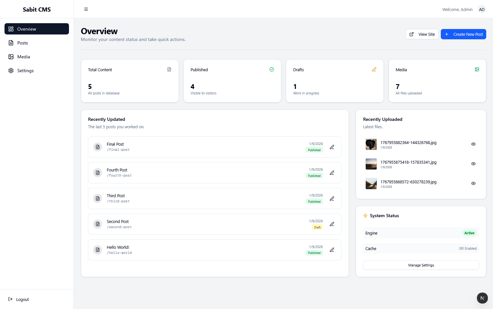
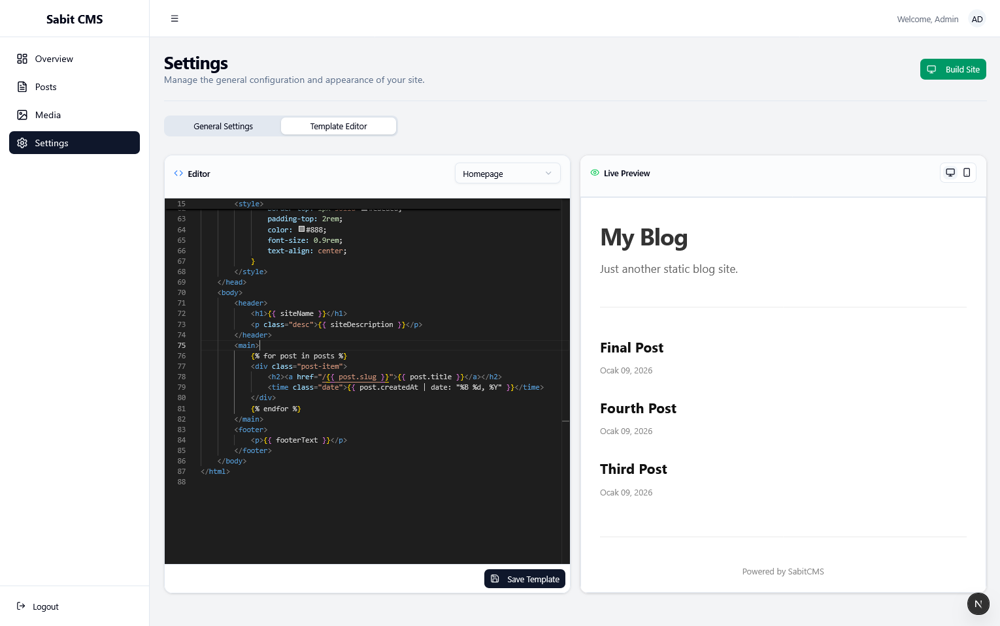
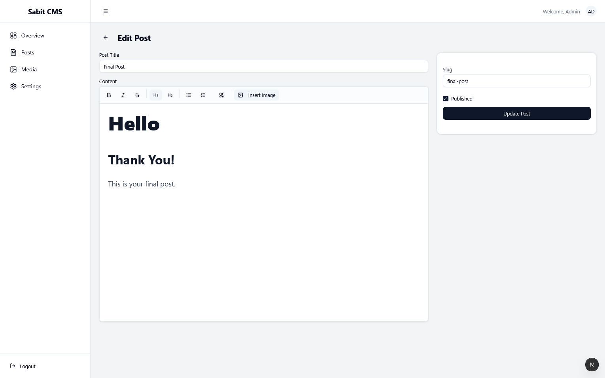
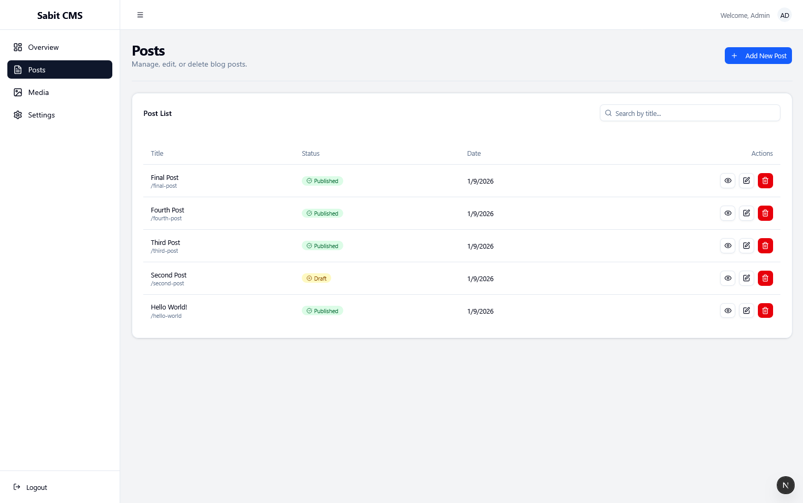

# SabitCMS: A Custom Static Site Generation Architecture

**SabitCMS** is a full-stack architectural study designed to reverse-engineer the core concepts of Static Site Generators (SSG).

Instead of relying on pre-built solutions like Next.js SSG or Gatsby for the rendering engine, I built a custom **Node.js-based build engine** from scratch. This project serves as a practical exploration of file system manipulation, caching strategies (ISR), and the decoupling of dynamic administration from static content delivery.



## Engineering Motivation

As a developer, I wanted to move beyond simply consuming frameworks and start understanding their internal mechanics. My primary goals for this project were:

1.  **Understanding SSG Internals:** How does a raw database record become a static HTML file efficiently?
2.  **Performance Optimization:** Implementing an "Incremental Static Regeneration" (ISR) logic manually to avoid full-site rebuilds.
3.  **System Architecture:** Designing a secure separation between the Admin Dashboard (Dynamic/Protected) and the Public Site (Static/Public).
4.  **Problem Solving:** Overcoming real-world integration challenges, such as dependency conflicts in rich-text editors and implementing live previews for server-side templates.

## Architecture & Design Decisions

### 1. The Custom Build Engine (Backend)
The core of SabitCMS is not just a CRUD API, but a compilation engine.
* **Logic:** It utilizes **LiquidJS** to parse dynamic templates stored in the database.
* **Performance:** Instead of querying the database on every request, the engine compiles content into static HTML files stored in the `dist/` directory.
* **ISR Implementation:** When a post is updated, the system identifies the specific file associated with that slug and rebuilds only that file. This drastically reduces server load compared to traditional CMSs.

### 2. The Split-Stack Approach
I chose to separate the concerns completely:
* **Admin Panel (Next.js 16):** A highly interactive, client-side heavy React application for content management.
* **Public Serving (Express/Node.js):** A lightweight static file server that serves pre-built HTML with zero database latency for end-users.

## Key Implementation Details

### Live Template Compilation
One of the biggest challenges was allowing users to edit HTML/Liquid templates and see changes without a full build.
* **Solution:** I implemented a `POST /preview` endpoint that accepts raw template strings, compiles them in-memory with dummy data, and returns the HTML.
* **Safety:** The preview is rendered within a sandboxed `iframe` with script injection to prevent navigation events, ensuring a smooth developer experience (DX).



### Advanced Rich Text Handling
Integrating a WYSIWYG editor (TipTap) required handling complex state management and asset handling.
* **Challenge:** Managing image uploads and resizing within the editor content.
* **Solution:** I implemented a custom TipTap extension to handle drag-and-drop uploads, interacting with a local `Multer` based file upload system.



### Content Management & Taxonomy
The dashboard provides a structured interface for managing content, enforcing type safety with TypeScript interfaces across the frontend and backend.



### Asset Management System
Instead of relying on third-party cloud storage, I built a local file management system to understand stream handling and file operations in Node.js.


## Tech Stack

* **Runtime:** Node.js
* **Frameworks:** Next.js 16 (App Router), Express.js
* **Database:** PostgreSQL (via Prisma ORM)
* **Templating:** LiquidJS
* **UI/Styling:** Tailwind CSS, Shadcn UI
* **Editor:** TipTap, Monaco Editor

## Installation

1.  **Clone the repository**
    ```bash
    git clone [https://github.com/ktezin/sabit.git](https://github.com/ktezin/sabit.git)
    ```

2.  **Setup Backend**
    ```bash
    cd backend
    npm install
    npx prisma db push
    npm run dev
    ```

3.  **Setup Frontend**
    ```bash
    cd admin
    npm install
    npm run dev
    ```

4.  **Initialization**
    Navigate to `http://localhost:3001`. The system detects a fresh install and redirects to the **Setup Wizard** to configure the initial admin account.
